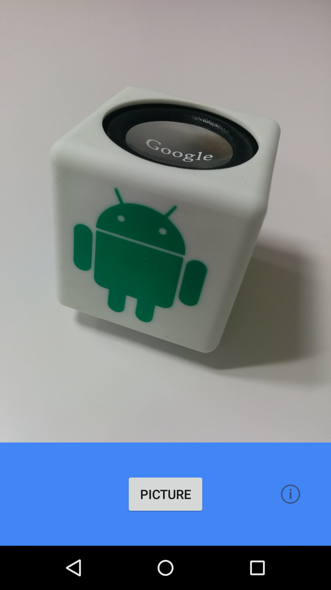

# CameraApp

<!-- README-OVERVIEW-IMAGE -->


Android Camera2Basic Sample
===================================

This sample demonstrates how to use basic functionalities of Camera2
API. You can learn how to iterate through characteristics of all the
cameras attached to the device, display a camera preview, and take
pictures.

Introduction
------------

The [Camera2 API][1] provides an interface to individual camera
devices connected to an Android device. It replaces the deprecated
Camera class.

Use [getCameraIdList][2] to get a list of all the available
cameras. You can then use [getCameraCharacteristics][3] and find the
best camera that suits your need (front/rear facing, resolution etc).

Create an instance of [CameraDevice.StateCallback][4] and open a
camera. It is ready to start camera preview when the camera is opened.

This sample uses TextureView to show the camera preview. Create a
[CameraCaptureSession][5] and set a repeating [CaptureRequest][6] to it.

Still image capture takes several steps. First, you need to lock the
focus of the camera by updating the CaptureRequest for the camera
preview. Then, in a similar way, you need to run a precapture
sequence. After that, it is ready to capture a picture. Create a new
CaptureRequest and call [capture][7]. Don't forget to unlock the focus
when you are done.

[1]: https://developer.android.com/reference/android/hardware/camera2/package-summary.html
[2]: https://developer.android.com/reference/android/hardware/camera2/CameraManager.html#getCameraIdList()
[3]: https://developer.android.com/reference/android/hardware/camera2/CameraManager.html#getCameraCharacteristics(java.lang.String)
[4]: https://developer.android.com/reference/android/hardware/camera2/CameraDevice.StateCallback.html
[5]: https://developer.android.com/reference/android/hardware/camera2/CameraCaptureSession.html
[6]: https://developer.android.com/reference/android/hardware/camera2/CaptureRequest.html
[7]: https://developer.android.com/reference/android/hardware/camera2/CameraCaptureSession.html#capture(android.hardware.camera2.CaptureRequest, android.hardware.camera2.CameraCaptureSession.CaptureCallback, android.os.Handler)

Pre-requisites
--------------

- Android SDK v21
- Android Build Tools v24.0.3
- Android Support Repository

Repository Baseline
-------------------

This repository intentionally does not track machine-local Gradle output,
Android Studio metadata, generated APK intermediates, or `local.properties`.
Set `ANDROID_HOME` or create your own untracked `local.properties` before
building.
The current source baseline also guards camera/file/thread lifecycle edges that
can be unavailable on devices without Camera2-compatible outputs.

The legacy build remains on Gradle 2.2.1, Android Gradle Plugin 1.0.0,
compile SDK 21, min SDK 21, target SDK 21, and support libraries 21.0.2.
Dependency resolution uses explicit HTTPS Maven Central and Google Maven
repositories instead of JCenter. Lint only suppresses the legacy `LintError`
infrastructure issue produced by this old toolchain.

Run the SDK-free baseline guard before committing:

```sh
scripts/check-baseline.sh
```

With the Android SDK available, verify the legacy Gradle project with:

```sh
ANDROID_HOME=/path/to/android-sdk ./gradlew tasks --no-daemon
ANDROID_HOME=/path/to/android-sdk ./gradlew assembleDebug --no-daemon
ANDROID_HOME=/path/to/android-sdk ./gradlew assembleDebugTest --no-daemon
ANDROID_HOME=/path/to/android-sdk ./gradlew check --no-daemon
```

Screenshots
-------------

 

Getting Started
---------------

This sample uses the Gradle build system. To build this project, use the
"gradlew build" command or use "Import Project" in Android Studio.

Support
-------

- Google+ Community: https://plus.google.com/communities/105153134372062985968
- Stack Overflow: https://stackoverflow.com/questions/tagged/android

If you've found an error in this sample, please file an issue:
https://github.com/googlesamples/android-Camera2Basic

Patches are encouraged, and may be submitted by forking this project and
submitting a pull request through GitHub. Please see CONTRIBUTING.md for more details.

License
-------

Copyright 2014 The Android Open Source Project, Inc.

Licensed to the Apache Software Foundation (ASF) under one or more contributor
license agreements.  See the NOTICE file distributed with this work for
additional information regarding copyright ownership.  The ASF licenses this
file to you under the Apache License, Version 2.0 (the "License"); you may not
use this file except in compliance with the License.  You may obtain a copy of
the License at

https://www.apache.org/licenses/LICENSE-2.0

Unless required by applicable law or agreed to in writing, software
distributed under the License is distributed on an "AS IS" BASIS, WITHOUT
WARRANTIES OR CONDITIONS OF ANY KIND, either express or implied.  See the
License for the specific language governing permissions and limitations under
the License.
