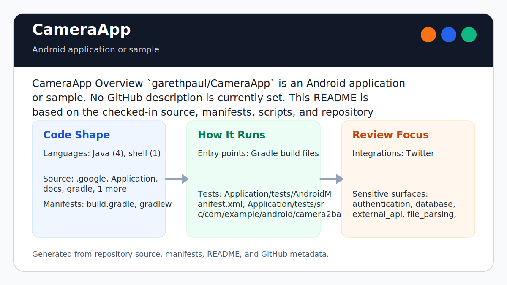

# CameraApp

<!-- README-OVERVIEW-IMAGE -->


## Overview

`garethpaul/CameraApp` is an Android application or sample. The checked-in files describe a Android application or sample with the structure summarized below.

This README is based on the checked-in source, manifests, scripts, and repository metadata on the `master` branch. The project language mix found during review was: Java (4), shell (1).

## Repository Contents

- `README.md` - project overview and local usage notes
- `.github/workflows/check.yml` - GitHub Actions baseline for `make check`
- `build.gradle` - Android or Gradle build configuration
- `.google` - source or example code
- `Application` - source or example code
- `docs` - source or example code
- `gradle` - source or example code
- `gradlew` - Android or Gradle build configuration
- `scripts` - source or example code
- `SECURITY.md` - security reporting and disclosure guidance
- `VISION.md` - project direction and maintenance guardrails

Additional scan context:

- Source directories: .google, Application, docs, gradle, scripts
- Dependency and build manifests: build.gradle, gradlew
- Entry points or build surfaces: Gradle build files
- Test-looking files: Application/tests/AndroidManifest.xml, Application/tests/src/com/example/android/camera2basic/tests/SampleTests.java

## Getting Started

### Prerequisites

- Git
- JDK 17
- Android SDK platform 36 and Android Build Tools 36.1.0
- The checked-in Gradle wrapper; a system Gradle installation is not required

### Setup

```bash
git clone https://github.com/garethpaul/CameraApp.git
cd CameraApp
```

Configure the Android SDK with `ANDROID_HOME` or an untracked `local.properties` file:

```properties
sdk.dir=/path/to/android-sdk
```

Set `JAVA_HOME` to JDK 17 and `ANDROID_HOME` (or `ANDROID_SDK_ROOT`) to the
Android SDK before invoking the verification targets.

## Running or Using the Project

- Use Android Studio to open the project or run the checked-in wrapper when the
  Android SDK is configured.
- The project uses Gradle 9.5.1, Android Gradle Plugin 9.2.0, compile/target SDK
  36, min SDK 21, and Android Build Tools 36.1.0.
- The application runtime dependency graph is intentionally empty. AndroidX is
  used only by the instrumentation smoke test.

## Testing and Verification

Run the SDK-free source baseline check first:

```sh
scripts/check-baseline.sh
```

Run the complete build gate with explicit toolchain paths:

```sh
JAVA_HOME=/path/to/jdk-17 ANDROID_HOME=/path/to/android-sdk make check
```

`make check` runs the source contract, debug and release lint, instrumentation
APK assembly and execution, and debug APK assembly. The lint gate requires zero findings;
only preview-SDK availability advisories are disabled while API 37 remains a
preview. The hosted API 36 emulator executes pre-permission activity/fragment
startup and drives the real camera-permission denial action while asserting the
activity remains stable; this does not prove permission grant, camera preview,
or capture behavior.

Focused Gradle commands are available after Android SDK configuration:

```sh
./gradlew :Application:lintDebug --no-daemon
./gradlew :Application:lintRelease --no-daemon
./gradlew :Application:assembleDebugAndroidTest --no-daemon
./gradlew :Application:connectedDebugAndroidTest --no-daemon
./gradlew :Application:assembleDebug --no-daemon
```

The wrapper pins the official Gradle 9.5.1 binary distribution and authenticates
it with `distributionSha256Sum`; an empty wrapper cache therefore requires
access to Gradle's HTTPS distribution service.

GitHub Actions installs JDK 17, Android SDK platform 36, Build Tools 36.1.0, and
the API 36 Google APIs emulator image, then runs the same `make check` gate on pushes, pull requests, and manual
dispatches. The workflow uses commit-pinned actions, read-only repository
access, a bounded runtime, and does not persist checkout credentials.

For local hosts without emulator acceleration, use
`SKIP_ANDROID_INSTRUMENTATION=1 make check` and record that runtime execution
was skipped. CI does not set this escape hatch.

When a camera-capable runtime is unavailable, do not claim preview, permission,
or capture behavior was exercised. Record the missing device validation and
retain the lint, APK, manifest, and static ordering evidence.

Use [`DEVICE_VERIFICATION.md`](DEVICE_VERIFICATION.md) to record exact-head
emulator or physical-camera evidence. Keep unavailable runtime scenarios as
explicit unexecuted rows rather than treating lint, APK assembly, or static
contracts as camera execution.

## Configuration and Secrets

- Detected references to Twitter. Keep API keys, OAuth credentials, tokens, and account-specific values in local configuration only.

## Security and Privacy Notes

- Review changes touching authentication or token handling; examples from the scan include Application/src/main/java/com/example/android/camera2basic/Camera2BasicFragment.java, docs/plans/2026-06-08-cameraapp-build-hygiene-baseline.md, scripts/check-baseline.sh.
- Review changes touching external API calls or credential-adjacent configuration; examples from the scan include docs/plans/2026-06-08-cameraapp-reproducible-build-baseline.md.
- Review changes touching network requests, sockets, or service endpoints; examples from the scan include Application/build.gradle, Application/src/main/AndroidManifest.xml, Application/src/main/java/com/example/android/camera2basic/AutoFitTextureView.java, Application/src/main/java/com/example/android/camera2basic/Camera2BasicFragment.java, and 6 more.
- Review changes touching mobile permissions or privacy-sensitive device data; examples from the scan include .google/packaging.yaml, Application/src/main/AndroidManifest.xml, Application/src/main/java/com/example/android/camera2basic/AutoFitTextureView.java, Application/src/main/java/com/example/android/camera2basic/Camera2BasicFragment.java, and 6 more.
- Review changes touching file, media, JSON, XML, CSV, OCR, or data parsing; examples from the scan include Application/src/main/AndroidManifest.xml, Application/src/main/java/com/example/android/camera2basic/Camera2BasicFragment.java, Application/src/main/res/layout/activity_camera.xml, Application/src/main/res/layout/fragment_camera2_basic.xml, and 6 more.
- Review changes touching database, model, or persistence code; examples from the scan include docs/plans/2026-06-08-cameraapp-build-hygiene-baseline.md, docs/plans/2026-06-08-cameraapp-reproducible-build-baseline.md.

## Maintenance Notes

- This looks like a legacy Android project or sample. Expect Android SDK, Gradle, and support-library versions to matter.
- Camera background thread startup is idempotent; repeated resume/start paths
  must not replace an already-running handler thread.
- Interrupted camera-worker shutdown preserves the interrupt signal and unresolved worker ownership.
- Camera-device disconnect and error callbacks close their callback device, but only the current device may clear shared state or finish the activity.
- Capture-result and still-capture completion callbacks reject stale session ownership before mutating capture state or unlocking focus.
- Current-session still-capture failures unlock focus and resume preview; stale session failures are ignored.
- Synchronous still-capture and preview-restart failures restore preview state before Camera2 recovery work can throw.
- Closed-session still-capture and preview-restart operations use the same
  recovery path instead of escaping with `IllegalStateException`.
- Missing still-capture dependencies restore preview state before the capture path returns.
- Configured preview callbacks must still own their exact initiating camera device before publishing preview state; stale sessions close instead.
- Failed preview callbacks rely on Camera2 session closure and suppress stale UI;
  only the initiating camera lifetime may report configuration failures.
- Synchronous camera-open failures release the open/close semaphore before
  pause or teardown can wait on it.
- Camera close releases the semaphore only after successful acquisition and
  restores interrupt status when acquisition is interrupted.
- Toast messages use a static main-looper handler with a weak fragment reference
  so queued UI messages do not retain a detached camera fragment.
- ImageReader backpressure is handled by dropping a backed-up capture callback
  before it can crash the still-image save path.
- During background-thread shutdown, rejected background-handler handoffs close
  the acquired image so the two-slot reader cannot be exhausted by an ownerless
  capture.
- CameraApp reports picture-save success only after file output closes
  successfully; Camera2 capture completion alone does not claim persistence.
- Android backup is disabled for the app because the sample handles camera
  capture state and app-specific image output.
- Resume skips camera open until the texture view is recreated, avoiding retained
  fragment camera work before the view hierarchy exists.
- Retained fragments clear the texture view at view teardown, so delayed camera
  permission results cannot reopen against a stale view hierarchy.
- Capture completion UI does not expose the app-private output file path.
- Image-save failures log a generic category without exception details or private output paths.
- Camera runtime diagnostics retain fixed operation categories without exception stack traces or throwable details.
- Picture and info controls are listener-bound only when present in the current
  layout.
- The application enables RTL mirroring, and portrait and landscape camera
  controls use logical end-side anchors for right-to-left locales.
- The preview reserves a separate end-side control rail in landscape, preventing
  localized picture/info controls from overlapping the camera surface.
- Unreachable Android sample-template resources are not packaged; the active
  camera layouts, application theme, and dialog copy remain intact.
- The active theme owns a single black window background, avoiding a redundant
  activity-root paint while preserving the camera launch/fallback surface.
- The active launcher and info resources include a complete xxxhdpi icon family,
  and SDK-backed verification requires a zero-finding Android lint report.
- Unsupported-camera error dialogs require an attached fragment manager before
  display.
- Unsupported-camera dialogs also require an attached activity before display.
- Root Makefile and Gradle wrapper commands resolve the repository path from the
  Makefile itself, including out-of-tree `make -f` verification.
- See `SECURITY.md` for vulnerability reporting and safe research guidance.
- See `VISION.md` for project direction and contribution guardrails.
- See `CHANGES.md` for the maintenance history.
- See `docs/plans/2026-06-09-cameraapp-texture-resume-guard.md` for the
  retained-fragment texture resume guard.
- See `docs/plans/2026-06-09-cameraapp-save-toast-path-privacy.md` for the
  capture saved-toast privacy baseline.
- See `docs/plans/2026-06-14-cameraapp-save-success-notification.md` for the
  success-only file-output notification boundary.
- See `docs/plans/2026-06-09-cameraapp-control-binding-guard.md` for the
  picture/info control binding guard.
- See `docs/plans/2026-06-09-cameraapp-error-dialog-fragment-manager.md` for
  the unsupported-camera dialog manager guard.
- See `docs/plans/2026-06-09-cameraapp-error-dialog-activity-guard.md` for the
  unsupported-camera dialog activity guard.
- See `docs/plans/2026-06-08-cameraapp-check-wrapper.md` for the root
  verification wrapper baseline.
- See `docs/plans/2026-06-10-ci-baseline.md` for the lightweight GitHub
  Actions baseline.
- See `docs/plans/2026-06-10-cameraapp-open-lock-release.md` for the synchronous
  camera-open semaphore recovery guard.
- See `docs/plans/2026-06-13-cameraapp-rtl-layout.md` for the logical camera
  control placement baseline.
- See `docs/plans/2026-06-13-cameraapp-landscape-overlap.md` for landscape
  preview/control region separation.
- See `docs/plans/2026-06-13-cameraapp-inactive-template-resources.md` for the
  inactive sample-template resource boundary.
- See `docs/plans/2026-06-13-cameraapp-window-background-overdraw.md` for the
  camera window background ownership boundary.
- See `docs/plans/2026-06-13-cameraapp-xxxhdpi-icons.md` for the active icon
  density and zero-finding lint boundary.

## Contributing

Keep changes small and tied to the project that is already present in this repository. For code changes, document the toolchain used, avoid committing generated dependency directories or local configuration, and update this README when setup or verification steps change.
